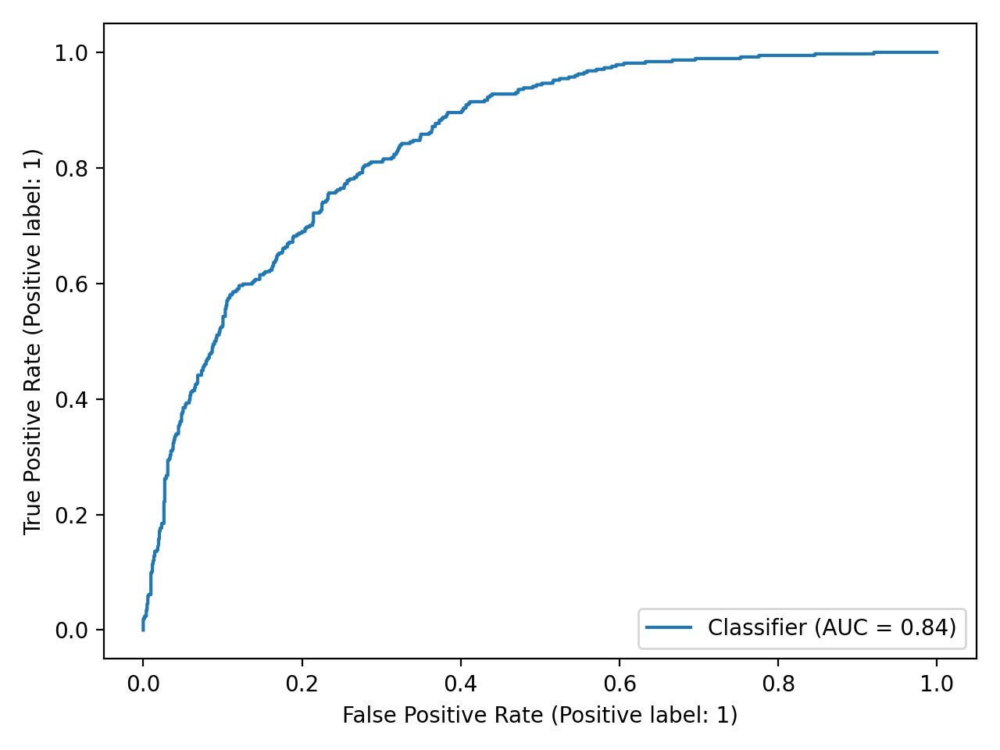
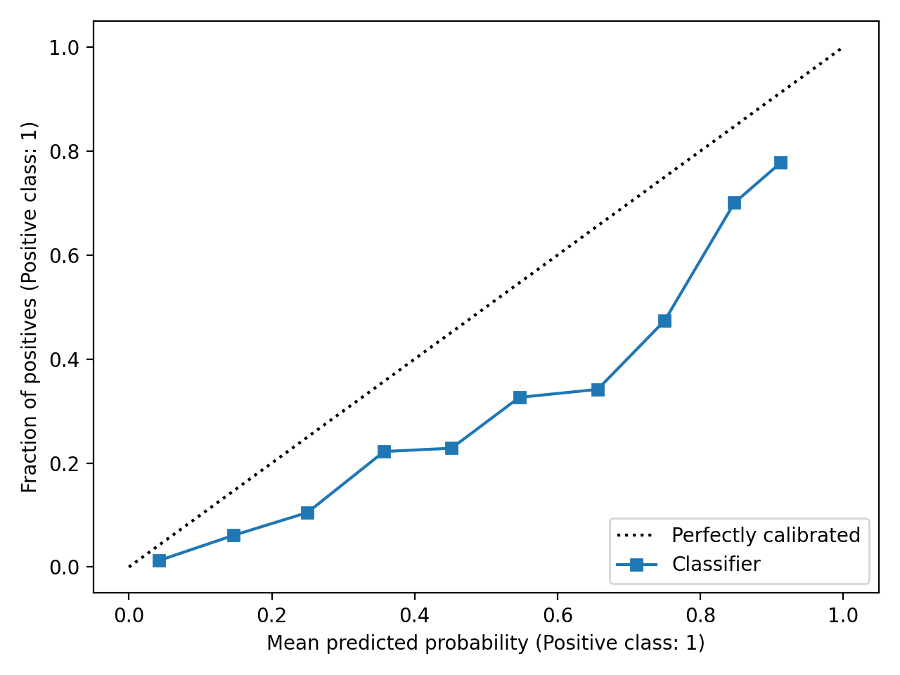

# Telco Churn

Predict customer churn with a **reproducible scikit-learn pipeline** (train → evaluate → save artifact → batch score) built for clean experimentation and easy reuse.

This repo focuses on:
- end-to-end preprocessing with `ColumnTransformer` and one-hot encoding
- probabilistic evaluation (ROC-AUC, PR-AUC, Brier score, and calibration curve)
- a simple **cost-aware threshold** recommendation
- a saved model artifact for batch scoring
- unit tests and GitHub Actions CI

---

## What’s in the box

**Modeling**
- One pipeline that includes preprocessing and model (no train/serve skew)
- Train/val split with fixed seed for reproducibility
- Optional class weighting / imbalance handling (config-driven)

**Evaluation**
- ROC curve and PR curve
- Calibration curve and Brier score
- Confusion matrix at an operating threshold
- Cost-aware threshold recommendation (false positives vs false negatives)

**Engineering and Reproducibility**
- Config-driven runs (`configs/*.yaml`)
- Saves: model artifact, metrics JSON, figures PNGs
- CLI entry points for training and batch scoring
- Tests + CI

---

## Quickstart

```bash
# 1) Create an environment & install
python -m venv .venv

# Windows (cmd)
.venv\Scripts\activate.bat
# Windows (PowerShell)
# .venv\Scripts\Activate.ps1

# macOS / Linux
# source .venv/bin/activate

pip install -r requirements.txt
pip install -e .

# 2) Add the dataset (update the filename/path if your config differs)
# Expected default location:
#   data/raw/telco_churn.csv
# Example (macOS/Linux):
mkdir -p data/raw
# cp /path/to/your/telco_churn.csv data/raw/telco_churn.csv
# Example (Windows PowerShell):
# New-Item -ItemType Directory -Force -Path data/raw | Out-Null
# Copy-Item C:\path\to\telco_churn.csv data/raw/telco_churn.csv

# 3) Train + evaluate
python -m telco_churn.train --config configs/base.yaml
```

## Example results

From one run using a **stratified 80/20 train/test split**:

- **ROC-AUC:** 0.8427  
- **PR-AUC:** 0.6381  
- **Brier score:** 0.1683  
- **Cost-aware threshold suggestion:** 0.15 *(example setting)*

### ROC curve


### Calibration curve

